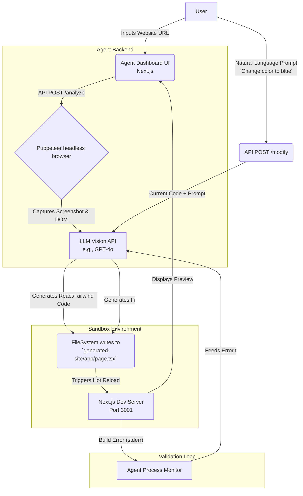

# Architecture Diagram

This diagram explains the flow of the AI-Powered Frontend Cloning Agent.

## Flow of Execution

## System Components

1. **Agent App (`agent/`)**: The control center. Provides a UI for the user to input URLs and prompts. Contains server-side API routes to control the browser and interface with the LLM.
2. **Sandbox (`generated-site/`)**: A clean Next.js app serving as the target environment. The Agent writes files directly to this directory.
3. **Puppeteer**: Used for visually analyzing the target URL.
4. **LLM**: The core intelligence taking visual and textual context to synthesize a new React frontend.
