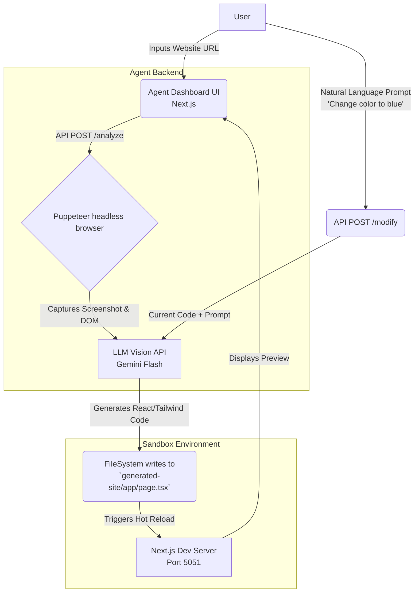

# AI-Powered Frontend Website Cloning Agent

An autonomous AI Agent that analyzes a given public website URL, recreates its UI as a responsive React/Next.js application, and allows natural-language modifications.

Built for the Founding AI Engineer Assignment.

## 🧠 Architecture Diagram

The system uses a robust two-app architecture to ensure that generated code errors never crash the Agent itself.



## 🚀 Quick Start

### Prerequisites
- Node.js (v18+)
- Gemini API Key

### 1. Setup the Agent
```bash
cd agent
npm install
# Add your API key
echo "GEMINI_API_KEY=your_api_key_here" > .env
```

### 2. Setup the Sandbox (Generated Site)
```bash
cd generated-site
npm install
```

### 3. Run the System
Open two terminal tabs:

**Terminal 1 (The Agent Dashboard):**
```bash
cd agent
npm run dev
```

**Terminal 2 (The Sandbox environment):**
```bash
cd generated-site
npm run dev
```

Open `http://localhost:5050` in your browser.

## 🛠️ Key Implementation Decisions
- **Next.js & Tailwind CSS**: Used as the target stack for generated code because it's highly prevalent and LLMs are extremely good at writing Tailwind within single-file React components.
- **Two-App System**: Separating the Agent's UI and API from the Generated Site Sandbox ensures that build errors in the generated code do not crash the Agent itself. The Agent safely manipulates the Sandbox via the filesystem.
- **Puppeteer for Analysis**: Headless browsing allows the Agent to capture accurate full-page screenshots and evaluate layout independently of complex DOM scraping.
- **Vision LLMs**: We treat UI cloning primarily as a visual reasoning task supported by DOM context, leveraging `gemini-flash` which excels at spatial layout translation.

## ⚠️ Limitations & Future Improvements
- **Authentication/Complex State**: The agent currently focuses on UI/Frontend recreation. It does not clone backend logic, user sessions, or complex interactive state machines.
- **Multiple Pages**: Currently generates a single robust landing page/UI. Expanding to full routing is a future step.
